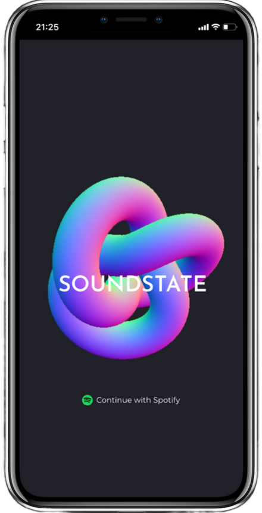

<div align="center">
    <a href="https://cheehwatang.com/#gh-dark-mode-only">
        
    </a>
    <a href="https://cheehwatang.com/#gh-light-mode-only">
        
    </a>
</div>

</br>

<p align="center">
    &emsp;
    <a href="https://cheehwatang.com/">
        
    </a>
    &emsp;
    <a href="https://linkedin.com/in/cheehwatang/">
        
    </a>
    &emsp;
    <a href="https://twitter.com/cheehwatang/">
        
    </a>
    &emsp;
</p>

## 👨🏻‍💻 What's Happening?

- 👨‍🎓 I've just completed **Le Wagon's 9 weeks Web Development Bootcamp**.
<p></p>

- 🐣 More Backstory <a href="https://cheehwatang.com/#about" alt="link to about page"><strong>Here</strong></a>
<p></p>

- 🌱 Learning **Node.js** & **Typescript**
<p></p>

- 🔍 Solving <a href="https://leetcode.com/cheehwatang/" alt="link to leetcode"><strong>LeetCode</strong></a> Challenges
<p></p>

- 💻 Working on <a href="https://www.soundstate.live" alt="link to SoundState.live"><strong>SoundState</strong></a>

- 🤔 Pondering on <a href="https://github.com/cheehwatang/github-readme-daily-quotes" alt="link to Github Readme Daily Quotes"><strong>Daily Quotes</strong></a>

<div>
    &emsp;&emsp;&emsp;
    <a href="https://github.com/cheehwatang/github-readme-daily-quotes#gh-dark-mode-only"> 
        
    </a>
    <a href="https://github.com/cheehwatang/github-readme-daily-quotes#gh-light-mode-only"> 
        
    </a>
</div>

</br>

- 🎧 Vibing to Tunes
<div>
    &emsp;&emsp;&emsp;
    <a href="https://open.spotify.com/user/12136120750#gh-dark-mode-only"> 
        
    </a>
    <a href="https://open.spotify.com/user/12136120750#gh-light-mode-only"> 
        
    </a>
</div>

</br>

## 🧰 My Toolbox

</br>

<p align="center">
    &emsp;
    <a href="#gh-dark-mode-only">
        
    </a>
    <a href="#gh-light-mode-only">
        
    </a>
    &emsp;
    <a href="#gh-dark-mode-only">
        
    </a>
    <a href="#gh-light-mode-only">
        
    </a>
    &emsp;
    <a href="#gh-dark-mode-only">
        
    </a>
    <a href="#gh-light-mode-only">
        
    </a>
    &emsp;
    <a href="#gh-dark-mode-only">
        
    </a>
    <a href="#gh-light-mode-only">
        
    </a>
    &emsp;
</p>

</br>

<p align="center">
    &emsp;
    <a href="#gh-dark-mode-only">
        
    </a>
    <a href="#gh-light-mode-only">
        
    </a>
    &emsp;
    <a href="#gh-dark-mode-only">
        
    </a>
    <a href="#gh-light-mode-only">
        
    </a>
    &emsp;
    <a href="#gh-dark-mode-only">
        
    </a>
    <a href="#gh-light-mode-only">
        
    </a>
    &emsp;
    <a href="#gh-dark-mode-only">
        
    </a>
    <a href="#gh-light-mode-only">
        
    </a>
    &emsp;
    <a href="#gh-dark-mode-only">
        
    </a>
    <a href="#gh-light-mode-only">
        
    </a>
    &emsp;
    <a href="#gh-dark-mode-only">
        
    </a>
    <a href="#gh-light-mode-only">
        
    </a>
    &emsp;
    <a href="#gh-dark-mode-only">
        
    </a>
    <a href="#gh-light-mode-only">
        
    </a>
    &emsp;
    <a href="#gh-dark-mode-only">
        
    </a>
    <a href="#gh-light-mode-only">
        
    </a>
    &emsp;
</p>

</br>

<p align="center">
    &emsp;
    <a href="#gh-dark-mode-only">
        
    </a>
    <a href="#gh-light-mode-only">
        
    </a>
    &emsp;
    <a href="#gh-dark-mode-only">
        
    </a>
    <a href="#gh-light-mode-only">
        
    </a>
    &emsp;
    <a href="#gh-dark-mode-only">
        
    </a>
    <a href="#gh-light-mode-only">
        
    </a>
    &emsp;
</p>

</br>

<p align="center">
    &emsp;
    <a href="#gh-dark-mode-only">
        
    </a>
    <a href="#gh-light-mode-only">
        
    </a>
    &emsp;
    <a href="#gh-dark-mode-only">
        
    </a>
    <a href="#gh-light-mode-only">
        
    </a>
    &emsp;
    <a href="#gh-dark-mode-only">
        
    </a>
    <a href="#gh-light-mode-only">
        
    </a>
    &emsp;
    <a href="#gh-dark-mode-only">
        
    </a>
    <a href="#gh-light-mode-only">
        
    </a>
    &emsp;
    <a href="#gh-dark-mode-only">
        
    </a>
    <a href="#gh-light-mode-only">
        
    </a>
    &emsp;
</p>

</br>

<p align="center">
    &emsp;
    <a href="#gh-dark-mode-only">
        
    </a>
    <a href="#gh-light-mode-only">
        
    </a>
    &emsp;
    <a href="#gh-dark-mode-only">
        
    </a>
    <a href="#gh-light-mode-only">
        
    </a>
    &emsp;
    <a href="#gh-dark-mode-only">
        
    </a>
    <a href="#gh-light-mode-only">
        
    </a>
    &emsp;
    <a href="#gh-dark-mode-only">
        
    </a>
    <a href="#gh-light-mode-only">
        
    </a>
    &emsp;
    <a href="#gh-dark-mode-only">
        
    </a>
    <a href="#gh-light-mode-only">
        
    </a>
    &emsp;
    <a href="#gh-dark-mode-only">
        
    </a>
    <a href="#gh-light-mode-only">
        
    </a>
    &emsp;
    <a href="#gh-dark-mode-only">
        
    </a>
    <a href="#gh-light-mode-only">
        
    </a>
    &emsp;
</p>

</br>

## 💡 Projects

<div align="left">
	<table>
	    <tr>
            <td width="50%">
                <h3 align="center"><strong>SoundState</strong></h3>
                </br>
                <div align="center">
                    <p>  
                        <a href="https://www.soundstate.live">
                            
                        </a>
                    </p>
                    </br>
                    <p>
                        <a href="https://github.com/weepotty/soundstate">
							
						</a>
                        &nbsp;
						<a href="https://www.soundstate.live">
							
						</a>
                    </p>
                    </br>
                    <p>
                        <a href="#gh-dark-mode-only">
                            
                        </a>
                        <a href="#gh-light-mode-only">
                            
                        </a>
                        &nbsp;
                        <a href="#gh-dark-mode-only">
                            
                        </a>
                        <a href="#gh-light-mode-only">
                            
                        </a>
                        &nbsp;
                        <a href="#gh-dark-mode-only">
                            
                        </a>
                        <a href="#gh-light-mode-only">
                            
                        </a>
                        &nbsp;
                        <a href="#gh-dark-mode-only">
                            
                        </a>
                        <a href="#gh-light-mode-only">
                            
                        </a>
                        &nbsp;
                        <a href="#gh-dark-mode-only">
                            
                        </a>
                        <a href="#gh-light-mode-only">
                            
                        </a>
                        &nbsp;
                        <a href="#gh-dark-mode-only">
                            
                        </a>
                        <a href="#gh-light-mode-only">
                            
                        </a>
                        &nbsp;
                        <a href="#gh-dark-mode-only">
                            
                        </a>
                        <a href="#gh-light-mode-only">
                            
                        </a>
                        &nbsp;
                        <a href="#gh-dark-mode-only">
                            
                        </a>
                        <a href="#gh-light-mode-only">
                            
                        </a>
                    </p>
                    </br>
                    <p>
                        SoundState is a smart playlist curator that allows you to filter your Spotify library according to your mood, and uses AI to generate a unique image for each playlist, for you to share and discover music that you love.
                    </p>
                    </br>
                </div>	
            </td>
            <td width="50%">
                <h3 align="center"><strong>Github Readme Daily Quotes</strong></h3>
                </br>
                <div align="center">
                    <p>  
                        <a href="https://github.com/cheehwatang/github-readme-daily-quotes">
                            
                        </a>
                    </p>
                    </br>
                    <p>
                        <a href="https://github.com/cheehwatang/github-readme-daily-quotes">
							
						</a>
                        &nbsp;
						<a href="https://readme-daily-quotes.vercel.app/api">
							
						</a>
                    </p>
                    </br>
                    <p>
                        <a href="#gh-dark-mode-only">
                            
                        </a>
                        <a href="#gh-light-mode-only">
                            
                        </a>
                        &nbsp;
                        <a href="#gh-dark-mode-only">
                            
                        </a>
                        <a href="#gh-light-mode-only">
                            
                        </a>
                        &nbsp;
                        <a href="#gh-dark-mode-only">
                            
                        </a>
                        <a href="#gh-light-mode-only">
                            
                        </a>
                        &nbsp;
                        <a href="#gh-dark-mode-only">
                            
                        </a>
                        <a href="#gh-light-mode-only">
                            
                        </a>
                        &nbsp;
                        <a href="#gh-dark-mode-only">
                            
                        </a>
                        <a href="#gh-light-mode-only">
                            
                        </a>
                        &nbsp;
                        <a href="#gh-dark-mode-only">
                            
                        </a>
                        <a href="#gh-light-mode-only">
                            
                        </a>
                    </p>
                    </br>
                    <p>
                        Github Readme Daily Quotes is a daily quotes svg generator for your github profile.
                    </p>
                    </br>
                        <a href="https://github.com/cheehwatang/github-readme-daily-quotes#gh-dark-mode-only"> 
                            
                        </a>
                        <a href="https://github.com/cheehwatang/github-readme-daily-quotes#gh-light-mode-only"> 
                            
                        </a>
                    </br>
                </div>
            </td>
        </tr>
	</table>
</div>

</br>

## 🔖 Featured Repository

<div align="center">
    <!-- SoundState Repo -->
    <a href="https://github.com/weepotty/soundstate#gh-dark-mode-only">
        
    </a>
    <a href="https://github.com/weepotty/soundstate#gh-light-mode-only">
        
    </a>
    <!-- LeetCode Java Repo -->
    <a href="https://github.com/cheehwatang/leetcode-java#gh-dark-mode-only">
        
    </a>
    <a href="https://github.com/cheehwatang/leetcode-java#gh-light-mode-only">
        
    </a>
    <!-- Github Readme Daily Quotes Repo -->
    <a href="https://github.com/cheehwatang/github-readme-daily-quotes#gh-dark-mode-only">
        
    </a>
    <a href="https://github.com/cheehwatang/github-readme-daily-quotes#gh-light-mode-only">
        
    </a>
</div>

</br>

## 📊 Weekly Development Breakdown

<!--START_SECTION:waka-->

```txt
From: 19 August 2023 - To: 26 August 2023

Total Time: 25 mins

Markdown   24 mins         ⣿⣿⣿⣿⣿⣿⣿⣿⣿⣿⣿⣿⣿⣿⣿⣿⣿⣿⣿⣿⣿⣿⣿⣿⣶   98.84 %
Java       0 secs          ⣤⣀⣀⣀⣀⣀⣀⣀⣀⣀⣀⣀⣀⣀⣀⣀⣀⣀⣀⣀⣀⣀⣀⣀⣀   01.16 %
```

<!--END_SECTION:waka-->

</br>

## 📈 My Stats

<div align="center">
    <!-- Contribution Heatmap with Snake Animation -->
    
    
    <!-- Github Activity Graph -->
    <a href="#gh-dark-mode-only">
        
    </a>
    <a href="#gh-light-mode-only">
        
    </a>
    <!-- Github Streak Stats -->
    <a href="#gh-dark-mode-only">
        
    </a>
    <a href="#gh-light-mode-only">
        
    </a>
    <!-- LeetCode Stats -->
    <a href="https://leetcode.com/cheehwatang#gh-dark-mode-only">
        
    </a>
    <a href="https://leetcode.com/cheehwatang#gh-light-mode-only">
        
    </a>
    <!-- Github Contribution 3D Profile -->
    
    
</div>

</br>

## 🌟 Credit & Thank You!

Appreciate the wonderful contributions from the community.

If you like their work, give a star to their repo and make your Github README shines.

</br>

<ul>
    <li>
        <a href="https://shields.io/#gh-dark-mode-only">
            
        </a>
        <a href="https://shields.io/#gh-light-mode-only">
            
        </a>
    </li>
    <li>
        <a href="https://github.com/tthn0/Spotify-Readme#gh-dark-mode-only">
            
        </a>
        <a href="https://github.com/tthn0/Spotify-Readme#gh-light-mode-only">
            
        </a>
        <a href="https://github.com/tthn0#gh-dark-mode-only">
            
        </a>
        <a href="https://github.com/tthn0#gh-light-mode-only">
            
        </a>
    </li>
    <li>
        <a href="https://github.com/athul/waka-readme#gh-dark-mode-only">
            
        </a>
        <a href="https://github.com/athul/waka-readme#gh-light-mode-only">
            
        </a>
        <a href="https://github.com/athul#gh-dark-mode-only">
            
        </a>
        <a href="https://github.com/athul#gh-light-mode-only">
            
        </a>
    </li>
    <li>
        <a href="https://github.com/Platane/snk#gh-dark-mode-only">
            
        </a>
        <a href="https://github.com/Platane/snk#gh-light-mode-only">
            
        </a>
        <a href="https://github.com/Platane#gh-dark-mode-only">
            
        </a>
        <a href="https://github.com/Platane#gh-light-mode-only">
            
        </a>
    </li>
    <li>
        <a href="https://github.com/Ashutosh00710/github-readme-activity-graph#gh-dark-mode-only">
            
        </a>
        <a href="https://github.com/Ashutosh00710/github-readme-activity-graph#gh-light-mode-only">
            
        </a>
        <a href="https://github.com/Ashutosh00710#gh-dark-mode-only">
            
        </a>
        <a href="https://github.com/Ashutosh00710#gh-light-mode-only">
            
        </a>
    </li>
    <li>
        <a href="https://github.com/DenverCoder1/github-readme-streak-stats#gh-dark-mode-only">
            
        </a>
        <a href="https://github.com/DenverCoder1/github-readme-streak-stats#gh-light-mode-only">
            
        </a>
        <a href="https://github.com/DenverCoder1#gh-dark-mode-only">
            
        </a>
        <a href="https://github.com/DenverCoder1#gh-light-mode-only">
            
        </a>
    </li>
    <li>
        <a href="https://github.com/JacobLinCool/LeetCode-Stats-Card#gh-dark-mode-only">
            
        </a>
        <a href="https://github.com/JacobLinCool/LeetCode-Stats-Card#gh-light-mode-only">
            
        </a>
        <a href="https://github.com/JacobLinCool#gh-dark-mode-only">
            
        </a>
        <a href="https://github.com/JacobLinCool#gh-light-mode-only">
            
        </a>
    </li>
    <li>
        <a href="https://github.com/yoshi389111/github-profile-3d-contrib#gh-dark-mode-only">
            
        </a>
        <a href="https://github.com/yoshi389111/github-profile-3d-contrib#gh-light-mode-only">
            
        </a>
        <a href="https://github.com/yoshi389111#gh-dark-mode-only">
            
        </a>
        <a href="https://github.com/yoshi389111#gh-light-mode-only">
            
        </a>
    </li>
    <li>
        <a href="https://github.com/anuraghazra/github-readme-stats#gh-dark-mode-only">
            
        </a>
        <a href="https://github.com/anuraghazra/github-readme-stats#gh-light-mode-only">
            
        </a>
        <a href="https://github.com/anuraghazra#gh-dark-mode-only">
            
        </a>
        <a href="https://github.com/anuraghazra#gh-light-mode-only">
            
        </a>
    </li>
    <li>
        <a href="https://github.com/NickeManarin/ScreenToGif#gh-dark-mode-only">
            
        </a>
        <a href="https://github.com/NickeManarin/ScreenToGif#gh-light-mode-only">
            
        </a>
        <a href="https://github.com/NickeManarin#gh-dark-mode-only">
            
        </a>
        <a href="https://github.com/NickeManarin#gh-light-mode-only">
            
        </a>
    </li>
    <li>
        <a href="https://github.com/mattboldt/typed.js#gh-dark-mode-only">
            
        </a>
        <a href="https://github.com/mattboldt/typed.js#gh-light-mode-only">
            
        </a>
        <a href="https://github.com/mattboldt#gh-dark-mode-only">
            
        </a>
        <a href="https://github.com/mattboldt#gh-light-mode-only">
            
        </a>
    </li>
    <li>
        <a href="https://github.com/matteobruni/tsparticles#gh-dark-mode-only">
            
        </a>
        <a href="https://github.com/matteobruni/tsparticles#gh-light-mode-only">
            
        </a>
        <a href="https://github.com/matteobruni#gh-dark-mode-only">
            
        </a>
        <a href="https://github.com/matteobruni#gh-light-mode-only">
            
        </a>
    </li>
</ul>

</br>

## 🙏 Final Words

<p>Thank you very much for reading until here 😊</p>
<p>If you like this README, feel free to fork the repo for your reference. Of course, give proper credits to the contributors who made this possible.</p>
<p>Have a blast! 🚀</p>

</br>


