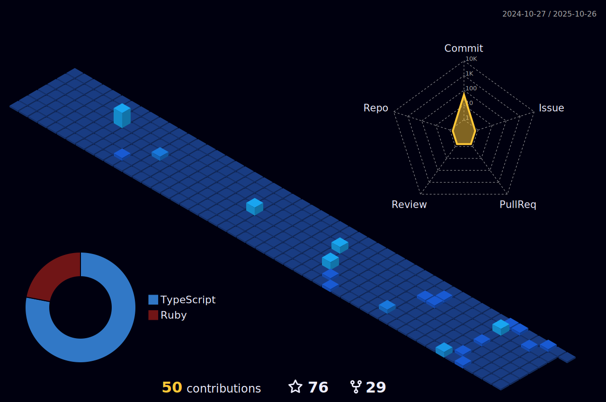

    

 

 

I am a full stack web developer staying in Singapore.  

I completed Le Wagon Web Development bootcamp. Now I am learning and building web apps every day!

While excited, there is so much to learn and having one quote to keep myself grounded.  

> He who climb the ladder must start at the bottom.

 

## 👨🏻‍💻 What's Happening?

<ul>
    <li> 💻 Working on <a href="https://www.soundstate.live" target="_blank" alt="link to SoundState.live">SoundState</a></li>
    <li> 🌱 Learning Node.js & Three.js</li>
    <li> 🔍 Practicing DSA on 
         with 
    </li>
</ul>

- Listening to tunes

 

## 🧰 My Toolbox

### 👉 Programming Languages

 
    &emsp;
    
    &emsp;
    
    &emsp;
    
    &emsp;

### 👉 Frontend Development

 
    &emsp;
       
    &emsp;
     
    &emsp;
    
    &emsp;
    
    &emsp;
    
    &emsp;
    
    &emsp;

### 👉 Frameworks

    &emsp;
    
    &emsp;
    
    &emsp;
    
    &emsp;

### 👉 Databases & Cloud Hosting

    &emsp;
    
    &emsp;
    
    &emsp;
    
    &emsp;
    
    &emsp;

### 👉 Software & Tools

    &emsp;
    
    &emsp;
    
    &emsp;
    
    &emsp;
    
    &emsp;

 

## 🙋‍♀️ Let's Connect

    &emsp;
    
    &emsp;
    
    &emsp;
    
    &emsp;

 

## 😎 Cool Stuff

    &emsp;
    
    &emsp;
     
    &emsp;
    
    &emsp;
    
    &emsp;
     
    &emsp;
    
    &emsp;

 
